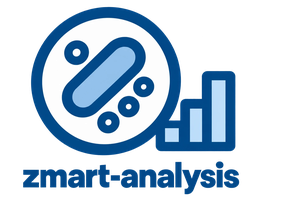

# ZMART Analysis

[](https://github.com/thomdehoog/ZMART-analysis/actions/workflows/test.yml)
[](https://www.python.org/downloads/)
[](LICENSE)
[](#status)

<table>
<tr>
<td width="170"></td>
<td valign="middle">

The **ZMART Analysis** engine analyses images while the microscope is still acquiring them, so its results can decide what the experiment images next. It runs on its own, and an interface, an AI agent or any workflow can plug it in.

It is part of [**ZMART**](https://github.com/thomdehoog/ZMART-microscopy) (ZMB's Microscopy-Agnostic Research Toolkit), the tools we use for smart microscopy at the Center for Microscopy and Image Analysis (ZMB), University of Zurich.

</td>
</tr>
</table>

## The Problem

When building smart microscopy workflows, you are likely to run into the
following four problems.

1. **Dependency conflicts.** Analysis pipelines consist of multiple steps.
   Each step needs the right environment with the right dependencies, and
   often there is no single environment in which all steps can run.

2. **Reproducibility.** Image analysis pipelines can be complex and are often
   fitted to one use case. They chain many algorithms, each with their own
   parameters. Making sure that these pipelines are reproducible, properly
   documented and easy to share is a challenge on its own.

3. **Time.** The analysis is often time sensitive. The microscope waits for the
   answer, so images must be analysed as soon as they come in and the
   analysis must keep up with the acquisition.

4. **Analysis over scopes.** Depending on the experiment, analysis needs to
   be done over single images, a group of images, a compartment, a carrier,
   or a whole experiment. However, the data does not come in all at once. A
   step over a larger scope can only start once the right set of images is
   in. Keeping track of all these analysis requirements calls for a higher
   degree of orchestration.

## The Solution

The ZMART Analysis pipeline engine addresses all four of them.

### 1. Every step can be executed in its own environment

Each step says which conda environment it needs, at the top of the step
file:

```python
METADATA = {"environment": "ZMART--object_analysis--cellpose"}
```

The pipeline engine runs each step in that environment and pieces the steps
together into one pipeline. Steps that name no environment run in the one
you started from. In this way, steps can share an environment or be
separated to neutralise dependency conflicts.

### 2. Pipelines are constructed in YAML files

Which steps are pieced together, in which order, with which parameters, is
defined in a YAML file:

```yaml
focus:
  - score_focus:
      metric: brenner      # brenner | dct | vollath_f4 | intensity
      channel: 0
      skip_ends: 2
```

An analysis is always started from this file, so it is reproducible and easy
to share and document. Every result also records, for each step, the
environment it ran in, the Python version, and the versions of the packages
it used. The file says what was asked for, and the result says what actually
ran.

### 3. Environments stay active, and several can run at once

During a run, the analysis environments (workers) are started once and stay
active, so each image is processed the moment it comes in. A model loaded
for the first image is still there for the next:

```python
def run(pipeline_data, state, **params):
    if "model" not in state:          # only on the first image
        state["model"] = load_the_model()
    ...
```

For one step, several workers can be spawned to analyse images concurrently:
one for a model on the GPU, many for work on the processor. A queue routes
incoming work to the right worker and lets urgent jobs go first.

```yaml
  - detect_objects_fast:
      max_workers: 12
```

### 4. Steps declare a scope

Each step says over which scope its analysis needs to run: a single image, a
group, a compartment, a carrier, or the experiment. Each level is a plain
number, so a compartment can be a well of a plate, a region of a slide or
part of a cleared sample. When all the data for a scope is in, the step
starts. Steps within one pipeline can differ in scope, so per-image steps run
as each image comes in while a per-carrier step waits for the whole carrier:

```yaml
object_analysis:
  - detect_objects:            # every image, as soon as it lands
  - extract_classical_features:
  - build_object_table:
  - summarise_population:      # each compartment, once it is complete
      scope: compartment
  - compare_populations:       # each carrier, once it is complete
      scope: carrier
```

```python
engine.submit("scoped", image, scope={"carrier": 1, "compartment": 3})
engine.submit("scoped", last_image, scope={"carrier": 1, "compartment": 3},
              complete="compartment")
```

The engine never guesses when a scope is complete. The acquisition knows, and
says so.

## Try it yourself

```bash
git clone https://github.com/thomdehoog/ZMART-analysis.git
cd ZMART-analysis
conda create -n zmart-analysis python=3.12 --override-channels -c conda-forge -y
conda activate zmart-analysis
python -m pip install -e ".[test]"
python workflows/focus/environments/setup_env.py   # once for each workflow you use
```

Python 3.11 or newer and conda are needed. Conda is how each step gets its
own software environment, and every environment comes from conda-forge only.

To see whether an environment made earlier still has what its workflow needs,
for example after an update, add `--check`:
`python workflows/object_analysis/environments/setup_env.py --step classical --check`.

Cellpose downloads its model (about 1.2 GB) the first time it runs, into
`.cellpose` in your home folder. To keep it elsewhere, for example where a
Windows profile has a size limit, set `CELLPOSE_LOCAL_MODELS_PATH` to that
folder before the first run.

The documentation, from the start:

- [How the engine works](docs/how-the-engine-works.md): recipes, workers,
  scopes, and what the engine reports.
- [Writing a step](docs/writing-a-step.md): the one function a step needs,
  and how to give it its own environment.
- [Folder structure](docs/folder-structure.md): where recipes, steps, tests
  and environments live.
- The workflows that ship, each with its own notes:
  [focus](workflows/focus/README.md),
  [object analysis](workflows/object_analysis/README.md), with its
  population summaries and plots, and
  [driver configuration](workflows/driver_configuration/pipelines/orientation.yaml).

### Status

This is a release candidate. The step format, the recipe layout and the
`Engine` calls are settled in spirit, and small changes may still happen
before 1.0. If you build a workflow on it, please open an issue so we can
keep the contract honest together.

## Testing

From the environment made in *Try it yourself*:

```bash
pytest -m "not cellpose and not conda_env and not pooch"
```

This is what the continuous integration runs on every change. Without the
`-m` filter the suite also runs the tests that need the per-step conda
environments, Cellpose with its model, and public sample images downloaded
on first use.

## Author

Thom de Hoog, Center for Microscopy and Image Analysis (ZMB), University of
Zurich (thom.dehoog@zmb.uzh.ch, thomdehoog@gmail.com).

## License

MIT License. See [LICENSE](LICENSE) for details, and [CITATION.cff](CITATION.cff)
for how to cite ZMART Analysis.

## Links

- [ZMART Microscopy](https://github.com/thomdehoog/ZMART-microscopy): the main repository, with the workflows
- [ZMART Controller](https://github.com/thomdehoog/ZMART-controller): one vocabulary for driving any microscope
- [ZMART Drivers](https://github.com/thomdehoog/ZMART-drivers): the drivers that plug into the controller
- [ZMART viewer](https://github.com/thomdehoog/ZMART-viewer): the viewer
- [ZMART AI agent](https://github.com/thomdehoog/ZMART-ai-agent): drive any microscope by chatting
- [Center for Microscopy and Image Analysis (ZMB)](https://www.zmb.uzh.ch), University of Zurich
